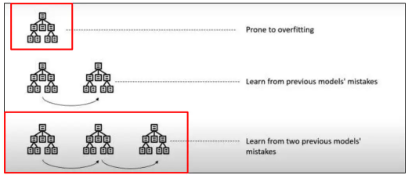
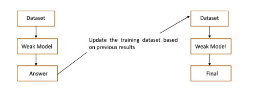
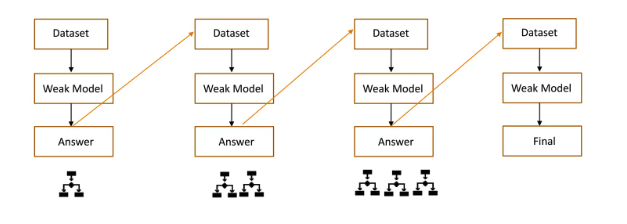

## 1. Ridge Regression (L2 Penalty)
- **Goal:** Handle multicollinearity by shrinking coefficients.
- **Mechanism:** Adds a penalty equal to the **sum of squared coefficients** (L2) to the loss function.
- **Effect:** Keeps all variables but shrinks their influence.
- **Use when:** You want to retain all features and reduce noise from collinearity.


## 2. Lasso Regression (L1 Penalty)
- **Goal:** Reduce model complexity and perform variable selection.
- **Mechanism:** Adds a penalty equal to the **sum of absolute coefficients** (L1).
- **Effect:** Pushes some coefficients **exactly to zero** (automatic feature selection).
- **Use when:** You expect only a few variables to be important.


## 3. Elastic Net (L1 + L2 Penalty)
- **Goal:** Combine ridge’s stability with lasso’s variable selection.
- **Mechanism:** Mixes L1 and L2 penalties to balance between shrinkage and selection.
- **Effect:** Selects features while keeping model robust with correlated predictors.
- **Use when:** Predictors are correlated and variable selection is needed.

## 4. Conditional Inference Tree (CIT)
- **Goal:** Build interpretable trees using statistical tests.
- **Mechanism:** Iteratively selects variables with the **lowest p-value** and splits based on significance.
- **Effect:** Produces a decision tree that models nonlinear effects and includes feature selection.
- **Use when:** You want interpretability and built-in variable selection.

## 5. Random Forest (RF)
- **Goal:** Improve predictive performance by combining many trees.
- **Mechanism:** Trains trees on **bootstrapped data** with **random subsets of variables** at each split.
- **Effect:** Averages predictions from many trees to reduce variance and improve generalization.
- **Use when:** You need high accuracy, handle multicollinearity, and don’t mind a less interpretable model.

# Learning Objectives

Our learning objectives are to:

-   Understand the XGBoost algorithm
-   Use the ML framework to:
    -   Pre-process data
    -   Train a XGBoost model
    -   Tune hyperparameters
    -   Evaluate model predictability
-   Learn to interpret model performance and feature importance

# Introduction

XGBoost, or **Extreme Gradient Boosting**, is a powerful machine learning algorithm based on the principle of **gradient boosting**.

It is especially useful for **structured/tabular data**, and is widely used in many **data science competitions and applications** due to its strong performance and flexibility.

XGBoost works by **sequentially building decision trees**, each of which corrects the errors of its predecessors.

Compared to Random Forest (which builds trees independently and aggregates their results), XGBoost focuses on **minimizing a loss function using gradient descent**.

## Gradient Boosting Overview

Gradient boosting is an ensemble technique that builds models sequentially, where each new model tries to correct the residual errors of the previous one.

Key elements of gradient boosting:

-   Models are trained in sequence.
-   The new model is trained on the residuals (errors) from the previous model.
-   All predictions are added together to make the final prediction.

Difference between Decision Tree, Random Forest and XGBoost

# Introduction

This script demonstrates how to build a regression model using the XGBoost algorithm. XGBoost (Extreme Gradient Boosting) is a powerful and efficient implementation of gradient boosted decision trees. We'll walk through each stage step-by-step, including data splitting, preprocessing, model specification, hyperparameter tuning, model evaluation, and interpretation of results.

## Why Use XGBoost?

XGBoost is one of the most popular and high-performing machine learning algorithms, especially for structured/tabular datasets. Here's why it's a great choice:

### ✅ Pros:

-   **High Accuracy**: XGBoost often outperforms other algorithms due to its robust boosting technique.
-   **Regularization**: Helps reduce overfitting (unlike standard Gradient Boosting).
-   **Fast and Scalable**: Parallel processing makes it very efficient.
-   **Built-in Handling of Missing Data**: XGBoost can natively handle missing values without needing imputation.
-   **Feature Importance**: It provides ranked importance of features, making it easy to interpret.
-   **Flexibility**: Works for both regression and classification tasks, and allows custom objective functions.

### ⚠️ Cons:

-   **Complexity**: More complex to tune than simpler models like linear regression or decision trees.
-   **Overfitting Risk**: Despite regularization, boosting methods can still overfit if not carefully tuned.
-   **Harder to Interpret**: Not as interpretable as a linear model or decision tree.
-   **Training Time**: Can be slower than simpler models, especially with large datasets and extensive tuning.

## How XGBoost Works

XGBoost builds an ensemble of trees sequentially, where each tree corrects the errors made by the previous ones. It uses a gradient descent algorithm to minimize the loss function.

Here’s a high-level summary: 1. Initialize model with a base prediction (e.g., mean for regression). 2. Compute gradients (errors) from current predictions. 3. Fit a tree to predict the gradients. 4. Add the tree's predictions to the existing model. 5. Repeat steps 2–4 for a fixed number of trees or until convergence.

### Three Core Steps to Gradient Boosting


**Step 1: Loss Function Optimized** – A differentiable loss function is used to calculate model error and guide optimization via gradient descent.

**Step 2: Weak Learner (Decision Tree)** – Simple decision trees are used to predict residuals (errors) from the previous iteration.

**Step 3: Trees Added Sequentially** – Each new tree tries to reduce the error made by the ensemble of previously trained trees. This continues iteratively, making the model more accurate.

## Limitations of XGBoost

Although powerful, XGBoost has some limitations:

1.  **Appropriate for supervised learning only** – It is not designed for unsupervised tasks like clustering.
2.  **Performance may degrade with highly complex data** – Since it’s built on decision trees, noisy or extremely non-linear patterns can challenge it.
3.  **Not ideal for time-series forecasting without adaptation** – XGBoost does not naturally handle time dependencies.


> Time-series data requires maintaining order and preventing information leakage. Instead of random splits, you must respect temporal sequences when splitting data (e.g., train on past → test on future).

**💡 Tip**: Consider using time-series cross-validation (e.g., rolling origin) and engineering lag features to adapt XGBoost for forecasting problems.

## What is Ensemble Learning?

Ensemble learning is a method in machine learning where multiple models (often called **weak learners**) are combined to solve the same problem and improve performance. The main idea is that combining the predictions of multiple models leads to better accuracy than relying on a single model. 

### Types of Ensemble Learning

-   **Bagging**: Combines the results of multiple models trained independently using different subsets of the data (e.g., Random Forest). 

-   **Boosting**: Models are trained sequentially. Each model tries to correct the errors of the previous one (e.g., XGBoost, AdaBoost).   \### Why Ensemble Learning Works:

-   It improves model performance by reducing variance and bias.

-   Ensemble methods are robust and can generalize better than individual learners.

**Both Random Forest and Gradient Boosting build models made of multiple decision trees.**\
But the key difference lies in **how the trees are built and combined**: - Random Forest builds trees **in parallel** (bagging). - Gradient Boosting builds trees **sequentially** (boosting).

### Visual Comparison of Bagging vs Boosting


## XGBoost vs Random Forest: A Comparison

Both XGBoost and Random Forest are tree-based ensemble methods that perform exceptionally well for classification and regression tasks, but they differ fundamentally in their structure and optimization strategies.

### 📊 Architecture

-   **Random Forest** builds multiple trees in parallel and combines their predictions using majority voting (classification) or averaging (regression).
-   **XGBoost** builds trees sequentially where each tree learns from the residuals of the previous ones, leading to higher model accuracy.

### ⏱️ Speed

-   Both algorithms utilize parallel processing.
-   XGBoost builds trees sequentially but speeds things up by parallelizing split-finding within trees.

### 🧠 Accuracy and Overfitting

-   Random Forests can overfit if individual trees see too-similar data.
-   XGBoost uses regularization and tree pruning (based on gain thresholds) to combat overfitting, making it more reliable in real-world applications.

### ⚙️ Hyperparameter Tuning

-   **Random Forest** is relatively simple to tune.
-   **XGBoost** is more complex, but it allows each tree to adjust iteratively using gradients, making it superior for dynamic or streaming data scenarios.

### ⚖️ Imbalanced Data

-   XGBoost handles class imbalance better by re-weighting misclassified samples.
-   Random Forest lacks a built-in mechanism for this.

### 🧪 Final Thought

-   **Random Forest** is simpler, faster to get started with, and great for baseline models.
-   **XGBoost** is more powerful and nuanced, suitable for high-performance applications where accuracy and control matter most.

Due to these strengths, XGBoost is the preferred algorithm in many winning solutions on platforms like Kaggle, and in industry-grade ML pipelines.


## XGBoost vs Random Forest vs Gradient Boosting


## XGBoost Advantages

-   Handles missing values internally
-   Offers regularization to reduce overfitting
-   Parallelizable and optimized for speed
-   Supports tree pruning and early stopping
-   Works well for both regression and classification

# Key XGBoost Hyperparameters

Here are the main hyperparameters to tune in an XGBoost model:

| Hyperparameter   | Description                                                     |
|------------------|------------------------------------------------------|
| `trees`          | Number of trees (boosting rounds)                               |
| `tree_depth`     | Maximum depth of each tree                                      |
| `min_n`          | Minimum number of data points in a node (child_weight)          |
| `loss_reduction` | Minimum loss reduction required to make a split (gamma)         |
| `sample_size`    | Proportion of rows used for each tree (subsample)               |
| `mtry`           | Number of features to consider at each split (colsample_bytree) |
| `learn_rate`     | Step size shrinkage used to prevent overfitting                 |

## 🔍 Explanation of Each Parameter

| **Parameter**    | **Meaning**                                                            | **Typical Range / Default**                  |
|----------------|-----------------------------------|----------------------|
| `trees`          | Number of boosting rounds (i.e., number of trees added sequentially)   | 100–1000+; Default \~100                     |
| `tree_depth`     | Maximum depth of each decision tree                                    | 3–10 (common); Default = 6                   |
| `min_n`          | Minimum number of observations in a node to split (`min_child_weight`) | 1–10+; Default = 1                           |
| `loss_reduction` | Minimum gain required to make a further partition on a leaf node       | 0–10+; Default = 0                           |
| `sample_size`    | Fraction of rows used in each boosting iteration (row subsampling)     | 0.5–1.0; Default = 1 (use all rows)          |
| `mtry`           | Number of predictors randomly sampled at each split                    | 1 to total number of features; Default = all |
| `learn_rate`     | Step size shrinkage to prevent overfitting (`eta`)                     | 0.01–0.3; Default = 0.3                      |

# ML Workflow with XGBoost

## 1. Data Preprocessing

-   Split data into training and testing sets
-   Use `recipe()` to define preprocessing steps
-   Do not normalize variables (not needed for tree-based models)

# Load the data

-   Setting a seed ensures reproducibility.

-   Splitting data helps validate generalizability by preventing the model from seeing the test data during training.

## Step 1: Load Libraries

We begin by loading the required libraries:

```{r}
#| message: false
#| warning: false
#install.packages("xgboost") #new pacakage
library(tidymodels)       # Main modeling framework it is a magepackage
library(finetune)         # For advanced tuning methods
library(vip)              # Variable importance plots
library(xgboost)          # For XGBoost implementation
library(ranger)           # For efficient random forest implementation
library(tidyverse)
library(finetune)
library(doParallel)
```

## Step 2: Load Dataset

We load the dataset and take a look at its structure:

```{r weather}
weather <- read_csv("../data/weather_monthsum.csv")
weather
```

## Step 3: Data Split

We split the data into training and testing sets using stratified sampling to maintain the distribution of the target variable: Setting a seed ensures reproducibility. Splitting data helps validate generalizability by preventing the model from seeing the test data during training.

```{r weather_split}
set.seed(931735) # Setting seed to get reproducible results 
weather_split <- initial_split(
  weather, 
  prop = .7, # proption of split same as previous codes
  strata = strength_gtex  # Stratify by target variable
  )
weather_split
```

```{r weather_train}
weather_train <- training(weather_split)  # 70% of data
weather_train #This is your traing data frame
```

```{r weather_test}
weather_test <- testing(weather_split)    # 30% of data
weather_test
```

How many observations?

Let's check the distribution of our predicted variable **strength_gtex** across training and testing:

```{r distribution}
ggplot() +
  geom_density(data = weather_train, 
               aes(x = strength_gtex),
               color = "red") +
  geom_density(data = weather_test, 
               aes(x = strength_gtex),
               color = "blue") 
  
```

## Step 4: Data Preprocessing

We remove unnecessary predictors like months and identifiers:

```{r weather_recipe}
# Create recipe for data preprocessing
weather_recipe <- recipe(strength_gtex ~ ., data = weather_train) %>% # Remove identifier columns and months not in growing season
  step_rm(
    year,       # Remove year identifier
    site,       # Remove site identifier
    matches("Jan|Feb|Mar|Apr|Nov|Dec")  # Remove non-growing season months
  )
weather_recipe
```

```{r weather_prep}
# Prep the recipe to estimate any required statistics
weather_prep <- weather_recipe %>% 
  prep()

# Examine preprocessing steps
weather_prep
```

## Step 5: Model Specification

We define an XGBoost model with hyperparameters to be tuned: trees: Number of trees influences model accuracy and computational time. tree_depth: Depth determines how complex and flexible each individual tree can become. learn_rate: Controls step size, impacting speed and accuracy of convergence. loss_reduction: Regularization parameter that helps prevent overfitting by requiring significant improvement to make additional splits. sample_size: Fraction of training data used for each tree, influencing model robustness and speed. \# Everything happens here

```{r xgb_spec}
xgb_spec <- boost_tree(
  trees = tune(),            # Total number of boosting iterations
  tree_depth = tune(),       # Maximum depth of each tree
  min_n = tune(),            # Minimum samples required to split a node
  learn_rate = tune()        # Step size shrinkage for each boosting step
) %>%
  set_engine("xgboost") %>%
  set_mode("regression")     # Set to "classification" if predicting categories

xgb_spec

```

## Step 6: Resampling

We use 5-fold cross-validation to evaluate model performance during tuning:

```{r}
set.seed(235) #34549
resampling_foldcv <- vfold_cv(weather_train, # Create 5-fold cross-validation resampling object from training data
                              v = 10)

resampling_foldcv
resampling_foldcv$splits[[1]]
```

## Step 7: Define Hyperparameter Grid

We use Latin hypercube sampling to generate a diverse grid of hyperparameter combinations:

```{r }
xgb_grid <- grid_latin_hypercube(
  tree_depth(),      # Controls tree complexity
  min_n(),           # Minimum number of samples needed to split a node
  learn_rate(),      # Step size shrinkage (learning rate)
  trees(),           # Total number of trees (boosting rounds)
  size = 100         # Number of hyperparameter combinations to generate
)#explain about grid lating hypercune instead of tune grid
```

xgb_grid \## Step 8: Model Tuning We perform tuning using the `tune_grid()` function:

```{r xgb_grid_result}
set.seed(76544)
registerDoParallel(cores = parallel::detectCores() - 1)
xgb_res <- tune_race_anova(object = xgb_spec,
                      preprocessor = weather_recipe,
                      resamples = resampling_foldcv,
                      grid = xgb_grid,
                      control = control_race(save_pred = TRUE))

stopImplicitCluster()


beepr::beep()
xgb_res$.metrics[[2]]
```

## Step 9: Select Best Models

We select the best models using three strategies (best, within 1 SE, within 2% loss):

```{r}
# Based on lowest RMSE
best_rmse <- xgb_res %>% 
  select_best(metric = "rmse")%>% 
  mutate(source = "best_rmse")

best_rmse_pct_loss <- xgb_res %>% 
  select_by_pct_loss("min_n",
                     metric = "rmse",
                     limit = 2
                     )%>% 
  mutate(source = "best_rmse_pct_loss")

best_rmse_one_std_err <- xgb_res %>% 
  select_by_one_std_err(metric = "rmse",
                        eval_time = 100,
                        trees
                        )%>% 
  mutate(source = "best_rmse_one_std_err")

best_rmse
best_rmse_pct_loss
best_rmse_one_std_err
```

```{r}
#here we use all three methods which we learn in this class
# Based on greatest R2
best_r2 <- xgb_res %>% 
  select_best(metric = "rsq")%>% 
  mutate(source = "best_r2")

best_r2_pct_loss <- xgb_res %>% 
  select_by_pct_loss("min_n",
                     metric = "rsq",
                     limit = 2
                     ) %>% 
  mutate(source = "best_r2_pct_loss")

best_r2_one_std_error <- xgb_res %>% 
  select_by_one_std_err(metric = "rsq",
                        eval_time = 100,
                        trees
                        ) %>%
  mutate(source = "best_r2_one_std_error")


best_r2
best_r2_pct_loss
best_r2_one_std_error
```

## Step 10: Compare and Finalize Model

```{r comparing values}
best_rmse %>% 
  bind_rows(best_rmse_pct_loss, best_rmse_one_std_err, best_r2, best_r2_pct_loss, best_r2_one_std_error)
```

```{r final_spec}
final_spec <- boost_tree(
  trees = best_r2_pct_loss$trees,           # Number of boosting rounds (trees)
  tree_depth = best_r2_pct_loss$tree_depth, # Maximum depth of each tree
  min_n = best_r2_pct_loss$min_n,           # Minimum number of samples to split a node
  learn_rate = best_r2_pct_loss$learn_rate  # Learning rate (step size shrinkage)
) %>%
  set_engine("xgboost") %>%
  set_mode("regression")

final_spec
```

## Step 11: Final Fit and Predictions

##Validation

```{r final_fit}
set.seed(10)
final_fit <- last_fit(final_spec,
                weather_recipe,
                split = weather_split)

final_fit %>%
  collect_predictions()
```

#Evaluate on Test Set

```{r final_fit}
final_fit %>%
  collect_metrics()
```

#R2 & RMSE = 0.1720

#best_r2_pct_loss = 0.2523

#best_r2_one_std_error = 0.1607

#best_rmse_pct_loss = 0.1934

#best_rmse_one_std_err = 0.1806

## Step 12: Evaluate on Training Set

```{r}
final_spec %>%
  fit(strength_gtex ~ .,
      data = bake(weather_prep, 
                  weather_train)) %>%
  augment(new_data = bake(weather_prep, 
                          weather_train)) %>% 
  rmse(strength_gtex, .pred) %>%
  bind_rows(
    
    
    # R2
    final_spec %>%
      fit(strength_gtex ~ .,
          data = bake(weather_prep, 
                      weather_train)) %>%
      augment(new_data = bake(weather_prep, 
                              weather_train)) %>% 
      rsq(strength_gtex, .pred)
    
  )
```

## Step 13: Predicted vs Observed Plot

```{r}
final_fit %>%
  collect_predictions() %>%
  ggplot(aes(x = strength_gtex,
             y = .pred)) +
  geom_point() +
  geom_abline() +
  geom_smooth(method = "lm") +
  scale_x_continuous(limits = c(20, 40)) +
  scale_y_continuous(limits = c(20, 40)) 
```

## Step 14: Variable Importance

```{r final_spec}
final_spec %>%
  fit(strength_gtex ~ .,
         data = bake(weather_prep, weather_train)) %>% #There little change in variable improtance if you use full dataset
    vi() %>%
  mutate(
    Variable = fct_reorder(Variable, 
                           Importance)
  ) %>%
  ggplot(aes(x = Importance, 
             y = Variable)) +
  geom_col() +
  scale_x_continuous(expand = c(0, 0)) +
  labs(y = NULL)
```

In this exercise, we covered:

-   XGBoost algorithms
-   Model training with ML workflows
-   Hyperparameter tuning with iterative search
-   5-fold cross-validation as the resampling method
-   Evaluation using RMSE and R² metrics
-   Model validation with test set performance
-   Predicted vs observed plots and variable importance

# Further Resources

-   <https://www.tmwr.org>

-   <https://r4ds.github.io/bookclub-tmwr/>

-   <https://bradleyboehmke.github.io/HOML/>

-   <https://cimentadaj.github.io/ml_socsci/>

-   <https://xgboost.readthedocs.io/en/stable/>

-   <https://xgboost.readthedocs.io/en/stable/parameter.html>

-   https://www.tmwr.org/tuning.html

-   https://www.analyticsvidhya.com/blog/2021/08/understanding-how-xgboost-works/

-   https://towardsdatascience.com/xgboost-vs-random-forest-vs-gradient-boosting-74b5fd50e20a
